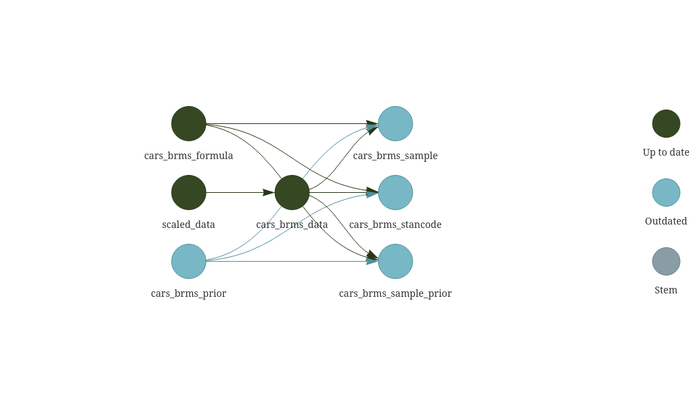

# `zarg`: Custom Target Functions and Factories

[](https://www.repostatus.org/#wip)


## Install

```{r, eval = FALSE}
remotes::install_github('robitalec/zarg')
```

## Functions/factories

- `zar_brms`: a draft/WIP `brms` integration with targets.
Simple target factory generating individual targets for priors,
formula, data, priors sampled (for prior predictive simulation/checks), stancode, and fitted `brms` models. 

```{r}
#| echo = FALSE,
#| warning = FALSE,
#| comment = ''
writeLines(readLines('_targets.R'))
```

```{r tar_viz}
#| include = FALSE,
#| eval = FALSE
targets::tar_visnetwork()
```




## Resources 

- https://wlandau.github.io/targetopia/contributing.html


## Thanks

Huge thanks to the developers of `targets`, `brms`, Stan, and R. 


---

Bürkner P. C. (2017). brms: An R Package for Bayesian Multilevel Models using Stan. Journal of Statistical Software. 80(1), 1-28. doi.org/10.18637/jss.v080.i01

Bürkner P. C. (2018). Advanced Bayesian Multilevel Modeling with the R Package brms. The R Journal. 10(1), 395-411. doi.org/10.32614/RJ-2018-017

Carpenter B., Gelman A., Hoffman M. D., Lee D., Goodrich B., Betancourt M., Brubaker M., Guo J., Li P., and Riddell A. (2017). Stan: A probabilistic programming language. Journal of Statistical Software. 76(1). 10.18637/jss.v076.i01

Landau, W. M., (2021). The targets R package: a dynamic Make-like
function-oriented pipeline toolkit for reproducibility and high-performance
computing. Journal of Open Source Software, 6(57), 2959,
https://doi.org/10.21105/joss.02959

R Core Team (2022). R: A language and environment for statistical computing. R
Foundation for Statistical Computing, Vienna, Austria. https://www.R-project.org/.
